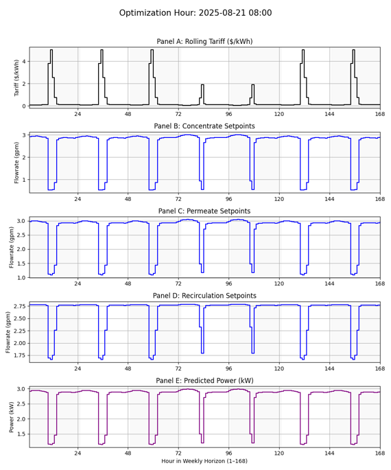

# **Empirical Model-Based Optimization in Water Treatment Systems (EMBO)**

Empirical Model-Based Optimization in Water Treatment Systems (EMBO) is a bi-directional digital–physical twin framework for real-time demonstration of closed-loop Model Predictive Control (MPC) in the water treatment industry.

This guide presents a simple overview of the `EMBO` package.

---

## **TL;DR**

EMBO streamlines real-time energy cost optimization in water reuse systems.  
The empirical model-based optimization pipeline integrates:

- Continuous model calibration  
- Cost-aware flowrate optimization  
- Physical actuation  

Operators and industry collaborators may use EMBO to adjust flowrate setpoints in response to electricity tariff fluctuations throughout the day or week.

---

## **Algorithm Overview**

The EMBO pipeline consists of two phases:

### **1. Surrogate Modeling**
An adaptive sparse **L1-regularized surrogate model (LASSO)** predicts power consumption as a function of:

- Permeate flowrate  
- Concentrate flowrate  
- Recirculation flowrate  
- Higher-order interaction terms  

### **2. Flowrate Optimization**
The model is then used to optimize flowrate setpoints to:

- Minimize specific energy cost (SEC)  
- Achieve a user-defined production volume  
- Satisfy all operational and safety constraints  

The model is developed entirely in Python and is used to optimize flowrates for a 7-day horizon (168 hours).  
EMBO expects:

- Initial setpoints  
- An electricity tariff schedule  

Tariffs determine SEC = (power × tariff). By combining an hourly updated L1-regularized surrogate with a rolling 168-hour optimization window, EMBO automatically adapts to changing tariff structures and process conditions.

The optimized schedule typically reduces specific energy cost while meeting weekly production requirements.  
All outputs—including regression coefficients, optimized setpoints, predicted power, cost savings, and comparison plots—are stored in the `results/` folder.

---

## **Overview Illustration**




---

## **Intended Purpose**

EMBO enables effective optimization of pilot-scale operation and quantifies operational cost savings that may translate to full-scale systems.  
The package relies on empirical modeling and optimization and does not require additional metadata.

---

## **Installation**

Clone this repository and install EMBO from source:

```bash
git clone https://github.com/submukherjee/EMBO_framework.git
cd EMBO_framework
pip install .
```

## **Getting Started**

After installation, run a full optimization cycle using :

```bash
python -m embo.run_optimization_single
```
This will :
- Train a surrogate model using the data in `input_files/`  
- Optimize flowrates using the tariff in `tariff_files/`   
- Save all results in `results/` folder

 User manual can be found in the [EMBO Documentation](https://embo-framework.readthedocs.io/en/latest/) pages. 
 
 ## **Authors** 
 - Subrata Mukherjee
  - Kris Villez
